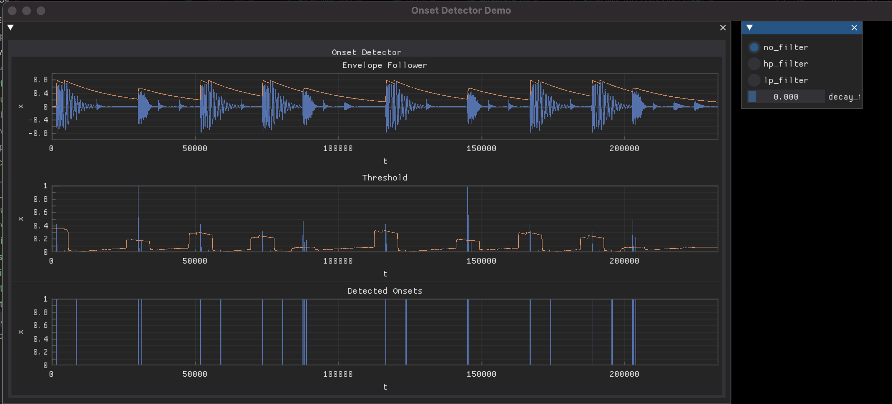

# Onset Detector Demo (Archived)

Two birds, one stone. An experimental (throw-away) project to learn about musical onset detection and dearpygui.

The task was to create an onset detector based on the theory described in this [thesis](https://repositorio.iscte-iul.pt/bitstream/10071/5991/1/dissertationCarlosRosao.pdf) [1], and evaluate it against librosa's implementation. Spoiler alert, librosa's onset detector has better performance and accuracy - surprise. The goal was not to create a high performance onset detector but rather to practice using dearpygui as a development tool UI for audio analysis projects.

The onset detector uses a time domain method of generating the onset detection function:
* compute the amplitude envelope of the signal
* compute the gradient of the envelope to create the detection function
* compute an adaptive threshold signal, based on a sliding window mean of the amplitude
* onsets are detected wherever the detection function exceeds the adaptive threshold

[1] Carlos Manuel Tadeia Rosao, Onset Detection in Music Signals